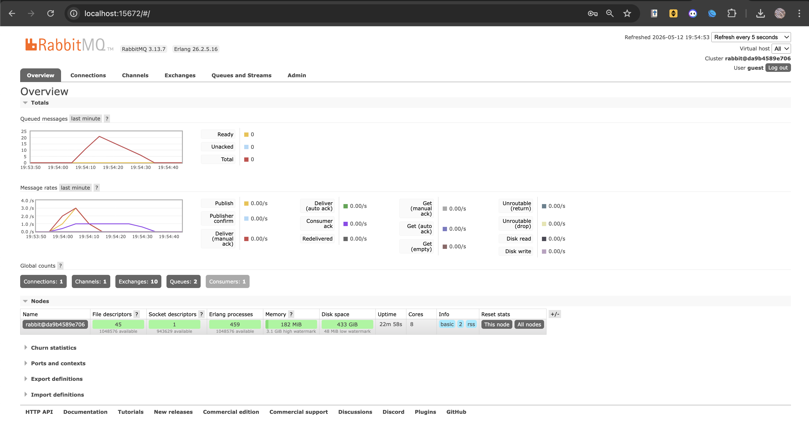
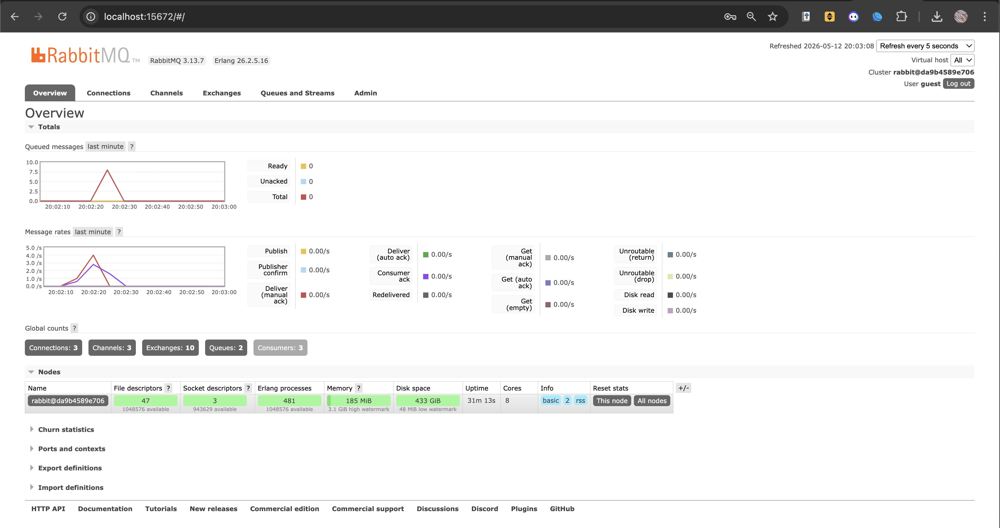

### Understanding Subscriber and Message Broker

**a. What is amqp?**
AMQP stands for Advanced Message Queuing Protocol. It is an open standard application layer protocol for message-oriented middleware, providing message orientation, queuing, routing (including point-to-point and publish-and-subscribe), reliability, and security.

**b. What does `guest:guest@localhost:5672` mean?**
- The first `guest` is the default username for RabbitMQ.
- The second `guest` is the default password for the RabbitMQ user.
- `localhost:5672` specifies the host machine (the local computer) and the default port number (5672) that the RabbitMQ server is listening on for AMQP connections.

### Simulating a Slow Subscriber

**Explanation of the Queue Spike:**
The total number of queued messages spiked to 20 because we intentionally slowed down the subscriber by uncommenting the `thread::sleep(_ten_millis);` line. This introduced a strict 1 second delay for every single message the subscriber processes. 

While the subscriber was busy sleeping, I executed the publisher program multiple times rapidly (firing 5 messages per run). Because the publisher's message production rate vastly exceeded the slow subscriber's consumption rate, the system created a bottleneck. RabbitMQ stepped in as a buffer, safely holding those 20 unacknowledged messages in the queue and feeding them to the subscriber one by one as it became available.

### Running Multiple Subscribers

**Reflection and Explanation:**
By running three subscriber instances simultaneously, we created a consumer cluster. When the publisher fired 25 messages (running 5 times), RabbitMQ did not send every message to every subscriber. Instead, it used a **round-robin distribution** strategy to evenly divide the workload. 

Looking at the terminal outputs, the load was balanced perfectly:
- Subscriber 1 processed 9 messages.
- Subscriber 2 processed 8 messages.
- Subscriber 3 processed 8 messages.

Because the workload was processed in parallel across three consumers, the messages were consumed much faster. This prevents the severe queuing and bottlenecks we saw with a single slow subscriber, demonstrating how message brokers easily facilitate horizontal scaling.

**Potential Code Improvements:**
Reviewing the current `publisher` and `subscriber` codebase, there are a few areas for architectural and structural improvement:
1. **Proper Error Handling:** Both applications currently swallow errors using the `_ = ...` syntax (e.g., `_ = p.publish_event(...)`). In a real-world scenario, we should properly handle these `Result` types using `match` statements or the `?` operator to catch and log connection drops or publishing failures.
2. **Dynamic Payload Generation (Publisher):** The publisher hardcodes the creation of Amir, Budi, Cica, Dira, and Emir sequentially. It would be much more scalable to store these in a `Vec` and iterate over them, or dynamically generate them based on user input.
3. **Idempotency (Subscriber):** The current `UserCreatedHandler` simply prints the message. If network latency causes RabbitMQ to re-deliver a message it thought was lost, the subscriber will process it twice. The handler should ideally check if a `user_id` has already been processed to ensure idempotency.
4. **Outdated Dependencies:** The compiler warnings regarding `nom v4.2.3` indicate that the underlying `crosstown_bus` crate relies on an older parser. Updating our dependencies to more modern versions would future-proof the codebase against upcoming Rust compiler updates.